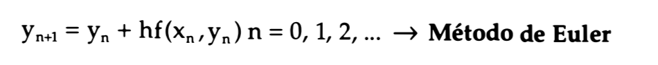
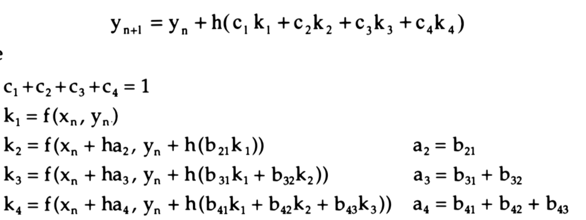
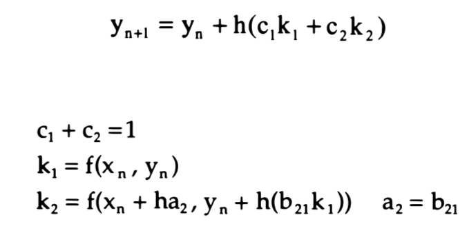

# TrabalhoFinalCNC
Trabalho final de Cálculo Numérico Computacional - UFPEL

* Grupo 1:
- Arthur Siqueira e Silva
- Ihan Belmonte Bender

## Enunciado 1
Utilize as regras do Trapézio repetida, 1/3 de Simpson repetida e 3/8 de Simpson
repetida para encontrar o valor aproximado de determinada integral. 

### Entrada

### Saída
Por fim, a saída do programa deverá ser o erro relativo, em relação a solução
analítica da integral utilizando 5 casas decimais, para os itens a, b, c.

**Solução analítica:** 3π +3

n = subintervalos entre a e b

h = (b - a)/m

### Trapézio repetida

### 1/3 de Simpson repetida

### 3/8 de Simpson repetida

## Enunciado 2
Utilize os métodos de Euler, Runge-Kutta 2a ordem e 4a ordem para encontrar
o valor aproximado de determinada derivada

### Entrada
y = -0.1x⁴ -0.15x³ -0.5x² -0.25x+1.2
x = 0.5
h = 0.25

### Saída
Por fim, a saída do programa deverá ser um gráfico para os itens a, b, c.

### Euler

### Runge-Kutta 2ª Ordem

### Runge-Kutta 4ª Ordem

## Enunciado 3
